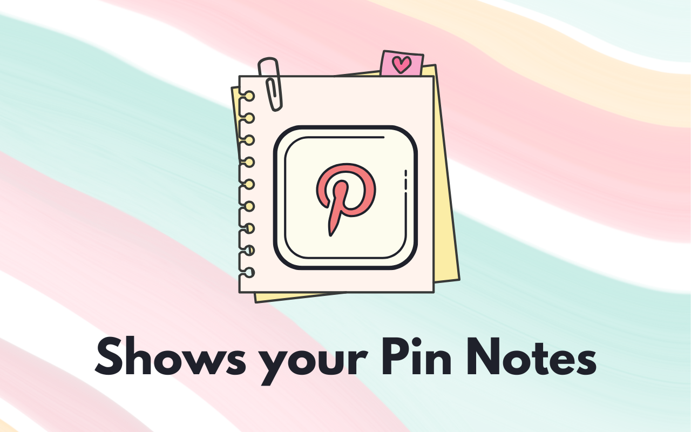

# Pinterest Show My Notes

Pinterest removed the ability to take notes. This extension lets you see them once again!

---

A small donation supports making new apps that make your life better 👇

## Features

Pinterest Show My Notes allows you to see the notes previously added to your Pinterest pins.

Feature:

- Quick Installation and No setup. It simply works!
- Automatically adds a button to any pin that contains a note
- Easy to access and easy to read notes
- Completely free to use

## Installation

This extension is available in the Chrome Web Store.

If you choose to install it from this repo, you can download and add it to Chrome yourself by enabling `Developer Mode` on the `chrome://extensions/` page. Just click `Load unpacked` and select this extension's folder.

## Support

If you have any questions or support related issues, please open a `New Issue` here: https://github.com/eric-mathison/pinterest-show-my-notes/issues
